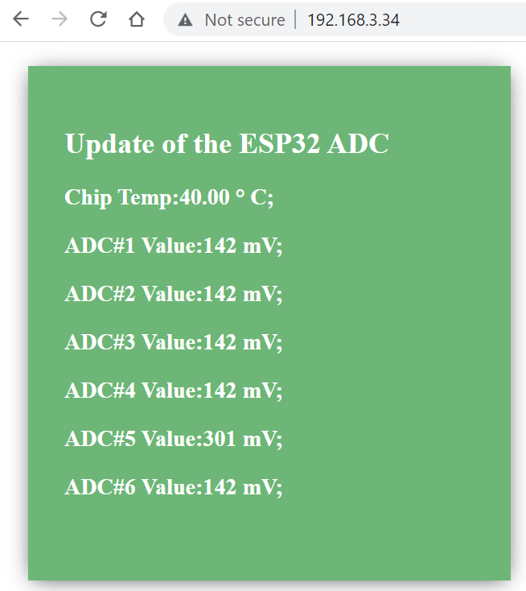

# ESP32 Web server to display the ADC readings
This application setup the ESP-Wroom-32 board as a web server, and displays the reading of
the chip's internal temperature sensor and the voltage readings (in the unit of mV) of the pin 
number `36,39,34,35,32,33`.
The ESP32 will connect to a wireless router (which must be set in the script), and the IP address
will be displayed on the 
serial port monitor. Then the web can be accessed using its IP address.

The ADC pin can be connected to a detector that has an output voltage, and convert 
the acquired voltage into the corresponding physical unit.
For example, if ADC#1 is connected to a temperature sensor, with voltage to temperature
relation of `10mV/deg`, the corresponding function `handleADC_1()` can be changed for 
to output the corresponding temperature value.

## Materials
- Hardware
  - [ESP-WROON-32 board](https://www.amazon.com/dp/B09XDMVS9N)
  - Micro USB Cable 
- Software
  - [Arduino website](https://docs.arduino.cc/software/ide-v1)
  - [AsyncTCP](https://github.com/me-no-dev/AsyncTCP) 
  - [ESPAsynWebServer](https://github.com/me-no-dev/ESPAsyncWebServer) 

## 0. install libraries

Arduino IED is used, and the installation can be found on [Arduino website](https://docs.arduino.cc/software/ide-v1).
ESP32 board is not supported by default in Arduino IDE, it can be installed by referring to 
'[Installing the ESP32 Board in Arduino IDE](https://randomnerdtutorials.com/installing-the-esp32-board-in-arduino-ide-windows-instructions/)'.

Copy the directories of [AsyncTCP](https://github.com/me-no-dev/AsyncTCP) and 
[ESPAsynWebServer](https://github.com/me-no-dev/ESPAsyncWebServer) 
into the `anduino` libraries. In my case, using Arduino under 
Windows operating system, the directory locates at 
`C:\Users\Wei Li\AppData\Local\Arduino15\libraries`.

## 1. Change the SSID and PASSWORD 
In `ESP32_ADC_WebServer.ino`, change the `ssid` and `password` to the one to be connected
to. If there is no password, then set `password` as `""`.

## 2. Change the name and conversion
If a sensor, which outputs a voltage that has a linear relation to the measured parameter,
is connected to an ADC channel, then change the name and function name in `index.h`
The corresponding function is defined in `ESP32_ADC_WebServer.ino` for the conversion.

## 3. Upload the program to the ESP32.
Select the correct board and port of the device, and then click the `->` button to upload the program.
After compiling and uploading, the IP address shows up on the monitor (which can be opened by 
clicking the `.o..`` on the top-right corner). An example output is as follows:
```
Connected to WIFI
IP address: 192.168.3.34
HTTP server started
```

Then the web can be accessed using `192.168.3.34`. In the following screenshot, ADC#5 is connected to a 
temperature sensor, which measures about `30.1 deg` with a conversion factor of `10mV/deg`.



Note:
The ADC2 pins can not be used as ADC, it's likely due to some conflict with `WIFI.h` setups (wireless uses all the 
ADC2 pins). 

## References
- [Installing the ESP32 Board in Arduino IDE](https://randomnerdtutorials.com/installing-the-esp32-board-in-arduino-ide-windows-instructions/)
- [Language Reference (Arduino.cc)](https://www.arduino.cc/reference/en/)

